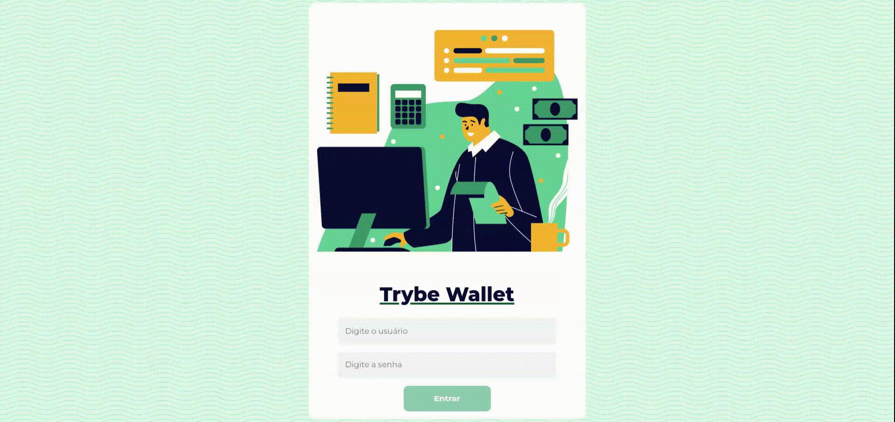

# Trybe Wallet

<p align="center">
  
</p>
</br>

### About:

TrybeWallet is a project in which an application was developed to help users manage their expenses in different currencies.

This was the first project where I started to pay more attention to how accessible my application is, so I followed up with a color palette that could be within the WCAG Standard - AA and AAA.

In addition, the project consisted of using ReactJS together with Redux to manage application states and the conversation between components and also using Bootstrap to make it responsive.

### Aplication

[Click here](https://trybewallet-eduardomuchak.vercel.app/) to view the final version of this project in your browser.

### Progress

- [x] Programming logic for application operation
- [x] Interface development (Mobile First)
- [x] Interface improvement for bigger screens (Tablets and Desktops).

## Technologies:

- Bootstrap
- JavaScript ES6+
- React.js
- React Router
- React Icons (Icon library)
- React Testing Library (RTL)
- Redux
- Vercel

## Methodologies:

- Mobile First
- Kanban

## How to run the application:

To download the code:

```
git clone git@github.com:eduardomuchak/16-trybe-wallet.git
```

Enter the project root folder:

```
cd 19-trybe-wallet
```

Install the dependencies:

```
npm install
```

Launch the application in your browser:

```
npm start
```

## Screenshots:

<p align="center">
  
  Login Page
</p>
</br>
<p align="center">
  
  Main Page
</p>
</br>
<p align="center">
  
  Running Application
</p>

## Responsive:

<p align="center">
  
</p>
<p align="center">
  Smartphone version
</p>
<p align="center">
  
</p>
<p align="center">
  Tablet version
</p>
